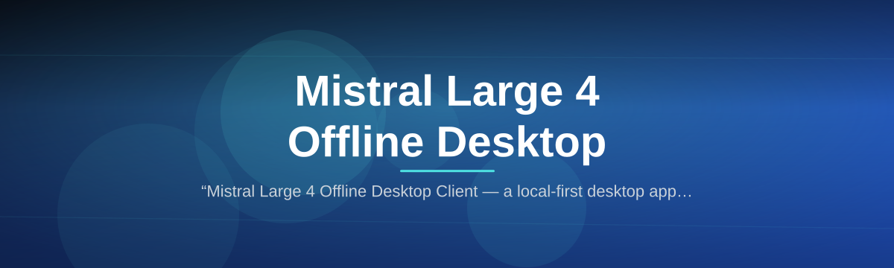
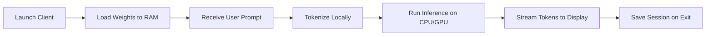

# mistral-offline-client

  

*Run Mistral Large 4 on your own Windows PC — no cloud, no data leaving your desk, no developer setup required.*

## What this is

Mistral Large 4 Offline Desktop Client is a standalone desktop application that brings the full Mistral Large 4 language model experience to your local machine. Instead of sending prompts through a browser to remote servers, this client loads the model weights and inference engine directly on your Windows computer, so every conversation stays private and works even when the internet does not.

The client wraps Mistral Large 4 in a lightweight native interface designed for everyday use. It is not a thin web wrapper or a remote API console — the model executes entirely on your hardware. For professionals handling sensitive documents, researchers working in air-gapped environments, or anyone tired of subscription tiers and usage caps, this client turns your existing PC into a private inference workstation.

  

This button takes you to the official project page where you can download the latest Windows installer.

## Who it is for

- **Privacy-conscious professionals** who cannot send client conversations, legal drafts, or medical notes to third-party cloud APIs.
- **Offline workers** — journalists, field researchers, and remote consultants who need a working LLM without depending on hotel Wi-Fi or cellular coverage.
- **Developers prototyping locally** who want a quick desktop shell for Mistral Large 4 experiments before they write their own integration.
- **Power users tired of metered plans** who prefer one-time software ownership over recurring tokens and seat fees.
- **Hobbyists and tinkerers** building home servers or dedicated AI machines that should function as self-contained appliances.

## What you can do

- **Run full conversations offline** — the model stays resident on your disk; no prompt fragments ever transmit over a network interface.
- **Process long documents locally** — paste or open text files up to the model’s full context window without hitting cloud token limits.
- **Switch between response styles** — use the built-in system prompt presets for concise technical answers, creative writing, or structured data extraction.
- **Save and organize sessions** — export complete chat histories to Markdown or JSON for later reference or audit trails.
- **Tune generation parameters** — adjust temperature, top-p sampling, and repetition penalty via simple sliders in the sidebar.
- **Batch-process text through a local API** — the client exposes an optional `localhost` endpoint so other tools on your PC can route requests to Mistral Large 4.
- **Run multiple model copies** — if your system has enough RAM, launch several independent sessions for parallel workloads.

## Getting started

1. Open the [download page](https://phasedatarear.github.io/mistral-offline-client/) from any browser.
2. Grab the `mistral-offline-client-setup-2026.exe` file (the installer is about 2.1 GB because the model weights are bundled).
3. Run the installer and accept the default install path (`C:\Program Files\MistralOffline`).
4. Launch the app from the Start Menu shortcut. The first start loads the model into memory — allow up to two minutes on mid-range hardware.
5. Type your first prompt in the main text area. You are chatting with Mistral Large 4 locally.

## Requirements

| Component | Minimum | Recommended |
|-----------|---------|-------------|
| Operating System | Windows 10 64-bit (22H2) | Windows 11 64-bit |
| Processor | 8-core CPU with AVX2 | 12-core CPU or better |
| RAM | 32 GB | 64 GB |
| Storage | 10 GB free space | NVMe SSD |
| GPU (optional) | Not required — CPU inference works | NVIDIA RTX 3060 or newer for acceleration |

The client runs as a standalone binary. You do not need Python, CUDA toolkit, Docker, or any package manager. Everything is self-contained in the installation folder.

## How it works

1. **Model loading** — on launch, the client reads the quantized Mistral Large 4 weights (Q4_K_M format) from the local `model/` directory and maps them into memory.
2. **Prompt processing** — your input text is tokenized locally on the CPU/GPU; the context window fills with your current conversation plus system instructions.
3. **Inference** — the transformer runs autoregressive decoding, generating one token at a time until it hits a stop sequence or the max token limit you set.
4. **Response display** — the generated text streams back into the chat window token-by-token for a live typing effect.
5. **Session persistence** — when you close the app, the client encrypts the conversation log and stores it in `%APPDATA%\MistralOffline\sessions` for future reload.

## FAQ

**Is Mistral Large 4 Offline Desktop Client truly offline?**
Yes. The model weights, tokenizer, and inference engine are all bundled in the installer. Once installed, the application does not initiate any network connection. You can block it in Windows Firewall and it will still work perfectly.

**How much RAM do I really need?**
The quantized 4-bit model consumes roughly 24 GB of RAM for the weights alone, plus additional memory for the context window and operating system. We recommend 32 GB as the practical floor; 64 GB gives you room for long documents and multi-session workflows.

**What happens if my computer runs out of memory?**
The client will fail to initialize the model and shows a clear error message with your current memory usage. It will not crash the system — it checks available RAM before mapping the weights.

**Can I use my NVIDIA GPU to speed things up?**
If you have an NVIDIA GPU with at least 8 GB VRAM, the client automatically uses CUDA for partial acceleration. The model still needs system RAM for full context, but GPU offloading speeds up token generation significantly.

**Does this include the newest Mistral Large 4 version?**
Yes, this 2026 release bundles the latest Mistral Large 4 iteration available at the build date. The model card inside the app (under Help → About) shows the exact version hash and quantization parameters.

## Troubleshooting

**The app starts but stays on “Loading model…” forever.**
This usually means insufficient RAM. Close other memory-heavy applications and retry. If the issue persists, check that you have at least 28 GB of free memory via Task Manager before launching.

**Token generation is extremely slow.**
First, verify your CPU meets the AVX2 requirement. You can check with the free tool CPU-Z. If you have a compatible NVIDIA GPU, open Settings → Inference and confirm “CUDA acceleration” shows “Enabled” — if not, update your GPU driver.

**I get an error about missing Visual C++ Redistributable.**
The installer includes the required runtime, but if Windows Update overwrote it, download and run the official “vc_redist.x64.exe” from Microsoft. Then restart the client.

**The local API endpoint does not respond.**
Open Settings → Local API and confirm the toggle is on. Ensure nothing else on port 8000 is running. Test by navigating to `http://localhost:8000/health` in your browser — you should see a JSON response.

## License

This project is released under the [MIT License](LICENSE). The Mistral Large 4 model weights are subject to their own separate license terms, which are documented in the `MODEL_LICENSE` file included in the installer. This repository contains the client application source code and integration logic, not the model weights themselves.

  

